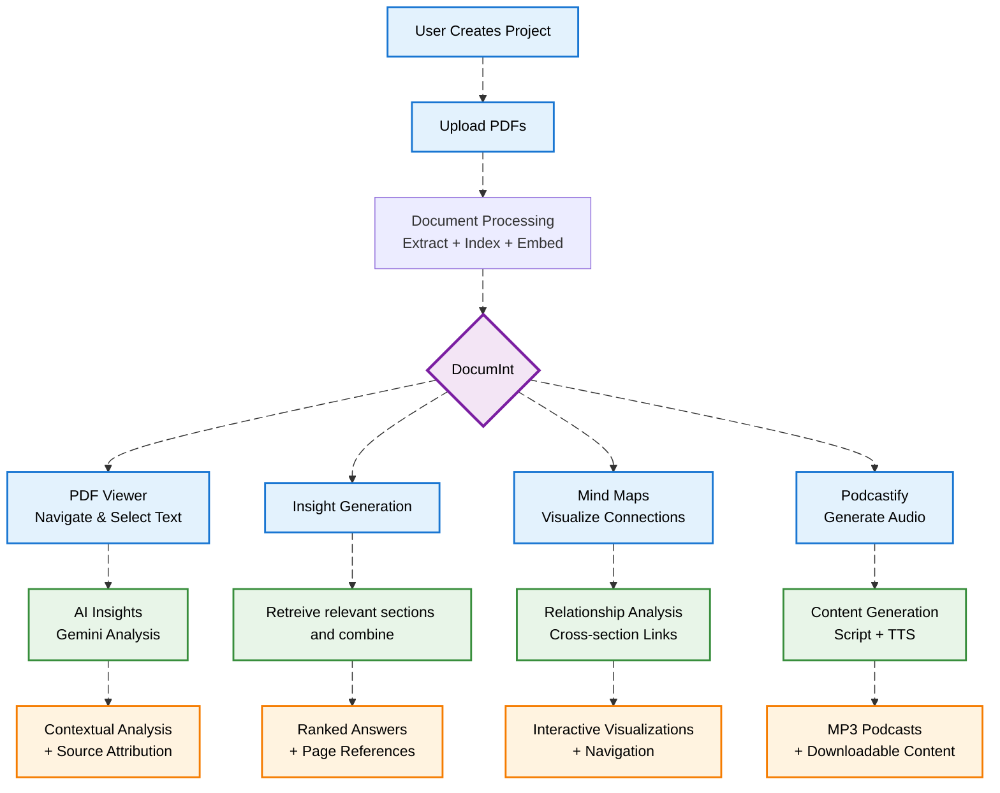

# 📘 DocumInt — Document Intelligence (PDF Outline, Retrieval, and AI Insights)

## Libraries Used
- **FastAPI**: 0.111+ (backend API server)  
- **Uvicorn**: 0.30+ (ASGI server for FastAPI)  
- **NumPy**: 1.24.3 (numerical computations)  
- **scikit-learn**: 1.3.0 (cosine similarity, tokenization utilities)  
- **PyTorch**: 2.0.1 (CPU version for embeddings backend)  
- **transformers**: 4.35.2 (embedding models)  
- **sentence-transformers**: 2.5.1 (embeddings for retrieval)  
- **rank-bm25**: 0.2.2 (BM25 scoring)  
- **PyMuPDF (fitz)**: 1.23.8 (PDF parsing & text extraction)  
- **Adobe PDF Embed SDK** (frontend viewer integration)  
- **TailwindCSS + React** (frontend UI styling and interactivity)  

---

## System Requirements
- **Python**: 3.10+ (tested with 3.11/3.12)  
- **Node.js**: 18+ and **npm** 9+  
- **Memory**: 500MB–1GB recommended (for embeddings + indexing)  
- **Storage**: ~1GB for models, caches, and temporary files  
- **Network**: Required for downloading models (70MB+) and optional Gemini/Azure API usage  

---

## Key Features and Metrics
- **Connecting the Dots**: Shows the most relevant sections across the PDFs
- **Hybrid Retrieval**: BM25 + Sentence Embeddings with domain-specific weighting  
- **PDF Outline Extraction**:
  - Built-in TOC when available
  - Manual TOC parsing
  - Heuristic fallback (fonts, regex, layout)  
- **Content Chunking**: Heading-aware segmentation, page-aware attribution  
- **AI Insights**:
  - Selection-based (select text with cursor on PDF → Gemini insights)  
  - Onscreen popover for insights  
  - Server-side Gemini analysis for contextual snippets  
- **Podcastify**: Generate podcast for the section along with insights for intuitive experience  
- **Azure TTS Integration**: Stream audio from text analysis
- **MindMap**: Visualizes all the relavant sections along with the corressponding text in the PDFs.
- **No Model Usage**: All relevant source search is done by our in-house engine and does not use AI models, which enhances speed by 5 times, and gives condiserable accuracy in search results.
- **Option to Add PDFs**: New PDFs can be added to the DocumInt(Project) on the fly.
- **Cachings**: Implemented caching for embeddings, podcasts, insights, mindmaps for faster retrieval.

> [!WARNING]
> Wait until the embeddings load, it might take 5 to 10 seconds, before you will be able to interact with the PDFs, take a look at the backend logs for a more detailed picture.

**Performance (local tests)**:
- PDF Outline extraction: ~1–2s per file  
- Hybrid retrieval build: Immediate (Takes ~5-10s until embeddings are done)

---

## 📁 File Structure
```
DocumInt/
├── Backend/
│   ├── app.py               # FastAPI backend (APIs, Gemini, Azure TTS)
│   ├── pdf_extractor.py     # Outline + TOC extractor
│   ├── run_pipeline.py      # CLI batch pipeline
│   ├── src/
│   │   ├── extract/         # heading_extractor.py, content_chunker.py
│   │   ├── retrieval/       # hybrid_retriever.py
│   │   ├── output/          # formatter.py
│   │   └── utils/           # file_utils.py
│   └── requirements.txt     # Backend dependencies
│
└── Frontend/ (React + Vite)
    ├── src/components/      # PDFViewer, OutlineSidebar, Chat, Insights
    ├── src/hooks/           # useAdobePDFNavigation, geminiService
    ├── index.html
    ├── vite.config.js
    └── tailwind.config.js
```

---

## 🔧 Prerequisites
### For Backend
- Python 3.10+  
- pip package manager  
- Internet (for downloading SentenceTransformers model)  

### For Frontend
- Node.js 18+  
- npm 9+  

### Required API Keys
- **Adobe PDF Embed API** → `VITE_ADOBE_API_KEY`  
- **Google Gemini API** → `VITE_GEMINI_API_KEY`  
- **Azure Speech (TTS)** → `SPEECH_API_KEY`, `SPEECH_REGION`  
Please use the above mentioned name for the API keys, else VITE does not recognise the keys.
We have used Azure Speech Service API for this application, so please do use the same API key for testing. (<a href="https://ai.azure.com/explore/models/aiservices/Azure-AI-Speech/version/1/registry/azureml-cogsvc/tryout#realtime">Click here to access the API page</a>).

---

## 🚀 Execution

### Local Execution

#### Option 1: Backend and Frontend Together

Go to `Backend/app.py` and change `/app/web/dist` to `../DocumInt/dist`

Go to `DocumInt` directory     and run `npm run build`.

```bash
cd Backend
python -m venv venv
source venv/bin/activate      # Linux/macOS
venv\Scripts\activate       # Windows

pip install -r requirements.txt
python app.py
```

Frontend & Backend runs on: `http://localhost:8000`

#### Option 2: Backend And Frontend Separated

For the backend:
```bash
cd Backend
python -m venv venv
source venv/bin/activate      # Linux/macOS
venv\Scripts\activate       # Windows

pip install -r requirements.txt
python app.py
```

For the Frontend:
```bash
cd DocumInt
npm install
npm run dev
```

The application will run on `localhost:5173`

---
### Docker Execution
- Docker build:
   ```console
   docker build --no-cache --build-arg VITE_ADOBE_API_KEY=YOUR_ADOBE_API_KEY --build-arg VITE_GEMINI_API_KEY=YOUR_GEMINI_KEY -t documint .
   ```
> [!NOTE]
> It takes around 350 to 500 seconds to build the Docker image.
- Docker run:
   ```console
   docker run --name documint -p 8080:8080 -e SPEECH_API_KEY="AZURE_TTS_KEY" -e SPEECH_REGION=eastus -e GEMINI_MODEL=gemini-2.5-flash -e VITE_ADOBE_API_KEY="YOUR_ADOBE_API_KEY" -e VITE_GEMINI_API_KEY="YOUR_GEMINI_KEY" documint:latest
   ```
> [!WARNING]
> The docker container runs on the port 8080, and can be accessed using `localhost:8080` ONLY
---

## 📡 API Endpoints

| Endpoint | Method | Description |
|----------|--------|-------------|
| `/` | GET | Frontend serving endpoint |
| `/extract-outline` | POST (file) | Extract title + structured outline |
| `/cache-pdfs` | POST (files[]) | Upload and cache PDFs |
| `/cache-status/{cache_key}` | GET | Check cache status |
| `/query-pdfs` | POST | Hybrid retrieval (persona + task) |
| `/analyze-chunks-with-gemini` | POST | AI-enhanced retrieval |
| `/podcastify-analysis` | POST | Generate conversational script |
| `/tts` | POST | Azure TTS (streaming audio) |

---

## 🏗️ Technical Implementation Details

### Core Algorithm
1. **Hybrid Retrieval (src/retrieval/hybrid_retriever.py)**  
   - **BM25**: Optimized k1/b per domain (Travel, Research, Business, Culinary, General)  
   - **Sentence Embeddings**: `paraphrase-MiniLM-L3-v2`  
   - **Scoring**: Weighted BM25 + embedding similarity  
   - **Domain-specific weights**:  
     - Travel → BM25(60%) + Embeddings(40%)  
     - Research → BM25(40%) + Embeddings(60%)  
     - Business → 50/50  
     - Culinary → BM25(70%) + Embeddings(30%)  

2. **Document Processing (src/extract/)**  
   - **Heading Detection**: Font size ratio, regex, position heuristics  
   - **Chunking**: Heading-based, page attribution, fallback single-chunk  

3. **Query Enhancement**  
   - Domain detection from persona/task  
   - Synonym expansion per domain (e.g., “recipe” → “dish, meal, preparation”)  

4. **Result Diversity**  
   - Remove near-duplicates (heading & doc-based diversity)  
   - Emphasize first-page and heading text  

---
## Troubleshooting
> [!WARNING]
> Make sure to follow the steps present to run the github repository.

- Remeber to use Azure Speech Service API only for Test-To-Speech(TTS).
- If there is no PDF Viewer loading, make sure you are on `localhost` and not on IP addresses like `127.0.0.1` or `0.0.0.0`.
- If the issue still persists, make sure to add the API key into the docker build command as well, due to the Vite's compile time loading.
- If any other issue is present, you can raise the Issue in the <a href="https://github.com/Amoghk04/DocumInt/issues">Issues tab</a>.
- **Embedding Waiting**: The Embeddings might take 5 to 10 seconds to load, so please wait until making any selection in the PDFs.
- If panels are not visible, click on edit layout -> reset layout.
---

## ⚠️ Error Handling & Robustness
- **Fallbacks**: BM25-only if embeddings/Gemini unavailable  
- **PDF parsing**: Skips errors gracefully, continues indexing  
- **Strict JSON Output**: Ensures schema consistency  
- **Key Security**: All API keys must be stored in `.env` for local storage, and added during build and runtime in docker building and running.

---



> Developed by Aditya K L, Amogh Kalasapura and Chirantana P as part of the Adobe India Hackathon 2025 Grand Finale. This project is registered under the GPL-3.0 License.
